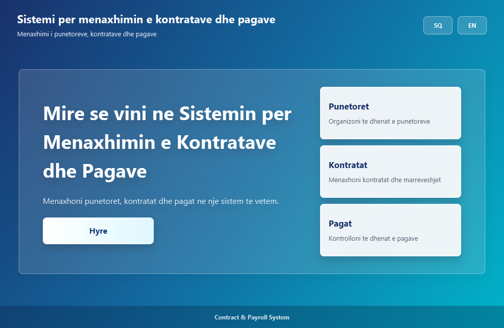
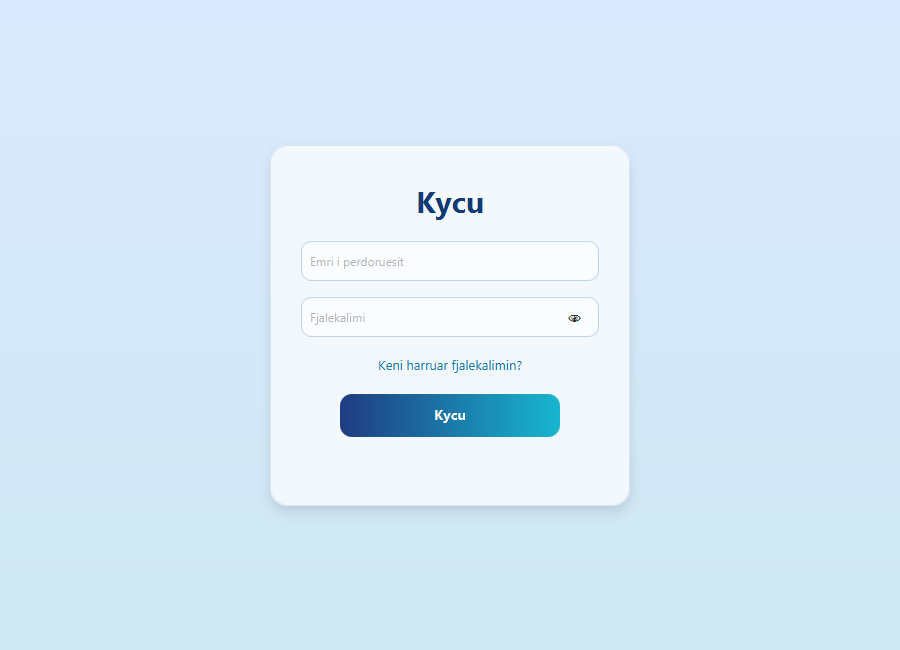

# Contract & Payroll Management System

Grupi 10 KNK project for an interactive desktop system that manages employees, departments, contracts, salaries, leave requests, and user access in one place.

## Group Members

- Arion Ukshini
- Arjanita Lestrani
- Florentina Dervishaj
- Edison Ukshini
- Arijola Krasniqi
- Alekta Thaqi

## Project Summary

This application is a JavaFX desktop system for company staff management. Administrators can manage employees, departments, contracts, salaries, user accounts, leave requests, and exports. Employees can log in to a separate user dashboard to view their contract, salary, department, leave requests, settings, and account details.

The app supports Albanian and English language switching, light and dark themes, keyboard navigation, styled dialogs, input validation, and demo data seeding through MySQL.

## Screenshots

### Welcome Screen



### Login Screen



## Main Features

- Admin and employee login flows
- Employee CRUD management
- Department management
- Contract management
- Salary management and salary history
- Leave request management for admins and users
- User account creation wizard
- Employee self-service views:
  - My Contract
  - My Salary
  - My Department
  - My Leaves
  - Settings
- Albanian and English translations
- Light and dark mode
- Keyboard and tab navigation
- Excel and PDF export support
- MySQL database initialization with demo data

## Tech Stack

- Java 21
- JavaFX 21.0.6
- Maven
- MySQL
- MySQL Connector/J 8.3.0
- Apache POI 5.2.5 for Excel export
- iText 5.5.13.3 for PDF export
- JUnit 5.10.2

## Requirements

Install these before running the project:

- JDK 21
- MySQL Server running locally
- Maven is optional because the project includes Maven Wrapper scripts:
  - `mvnw` for macOS/Linux
  - `mvnw.cmd` for Windows

## Database Setup

The app creates and initializes the database automatically when it starts.

Default database configuration is in:

`src/main/java/com/company/system/db/DBConnection.java`

Current defaults:

```text
Database: grupi_10
Host: localhost
Port: 3306
Username: root
Password: pass
```

If your MySQL password is different, update `USER` and `PASSWORD` in `DBConnection.java` before running.

## Demo Logins

Default admin account:

```text
Username: admin
Password: 1234
Role: ADMIN
```

Default employee accounts:

```text
Username: arion.ukshini
Username: arjanita.lestrani
Username: florentina.dervishaj
Username: edison.ukshini
Username: arijola.krasniqi
Username: alekta.thaqi
Password: 1234
Role: USER
```

Employee users are marked to change their password on first use.

## How To Run

From the project root:

```powershell
.\mvnw.cmd clean javafx:run
```

If `JAVA_HOME` is not set, set it first. Example:

```powershell
$env:JAVA_HOME = "C:\Program Files\Java\jdk-22"
.\mvnw.cmd clean javafx:run
```

On macOS/Linux:

```bash
./mvnw clean javafx:run
```

## How To Build

Compile and package the project:

```powershell
.\mvnw.cmd clean package
```

Run the test/build verification:

```powershell
.\mvnw.cmd test
```

The compiled output is generated in the `target/` directory.

## Project Structure

```text
src/main/java/com/company/system
  controller/      JavaFX controllers for all screens
  db/              MySQL connection and database initialization
  exceptions/      Custom application exceptions
  i18n/            Language manager
  model/           Data models
  service/         Business logic and database operations
  utils/           Session, validation, dialogs, password, keyboard helpers

src/main/resources
  views/           FXML screens
  styles/          Application CSS theme
  icons/           App icons
  messages_en.properties
  messages_sq.properties

docs/screenshots  README screenshots
```

## Notes

- MySQL must be running before launching the app.
- The database and demo data are created automatically if they do not exist.
- If login fails on a fresh setup, confirm that the MySQL credentials in `DBConnection.java` match your local MySQL user.
- If Maven cannot find Java, set `JAVA_HOME` to your installed JDK path.

